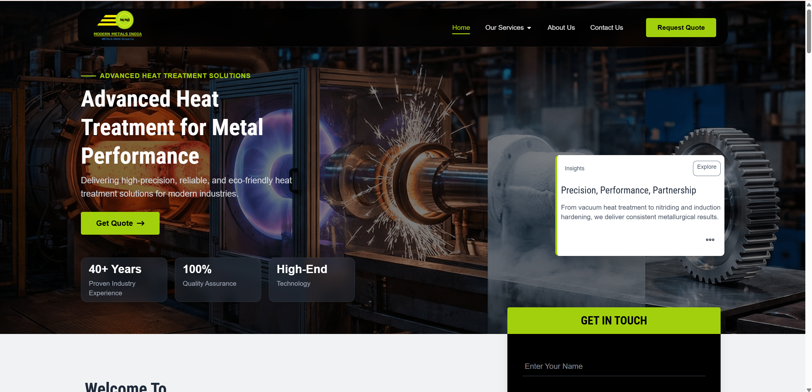

# 🏭 Modern Metals India

> **Transforming four decades of engineering expertise into a modern, high-performance digital presence.**

---

## 🌐 Client

**Client:** Modern Metals India

**Industry:** Heat Treatment & Metallurgy

**Duration:** 4 Months

**Website:** https://www.modernmetalsindia.com

---

## 📌 Services Delivered

- ⚛️ React Website Development
- 🎨 UI/UX Design
- 🏗️ Information Architecture
- 📱 Responsive Web Development
- 🚀 Performance Optimization

---

## 🎯 Project Overview

Modern Metals India partnered with The Digital Hike to modernize its digital presence with a React-based website that reflects over four decades of engineering excellence. The objective was to create a fast, scalable, and credibility-focused platform that helps industrial buyers quickly understand the company's capabilities and generate quality business inquiries.

---

## 🚀 What We Built

- ✅ Modern React Website
- ✅ Responsive User Experience
- ✅ Technical Content Architecture
- ✅ Industrial Service Showcase
- ✅ Mobile-First Design
- ✅ Conversion-Focused Navigation
- ✅ Inquiry Generation Structure

---

## 💡 Key Features

- Fast React-based architecture
- Mobile-first responsive design
- Engineering-focused information hierarchy
- Process and industry-specific pages
- Credibility-driven user experience
- Optimized inquiry flow

---

## 📄 Case Study

📥 **[Download the Complete Case Study](modern-metals-case-study.pdf)**

---

## 📸 Website Showcase

### 🏠 Homepage

---

### ⚙️ Services

---

### 🏭 Industries

---

### 📞 Contact

---

## 🌍 Live Website

https://www.modernmetalsindia.com

---

## ← Back to Portfolio

[⬅ Return to Portfolio](../../README.md)
