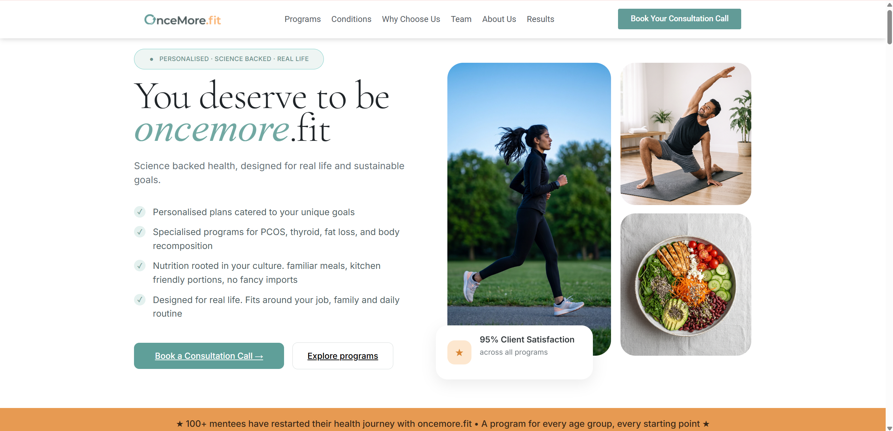
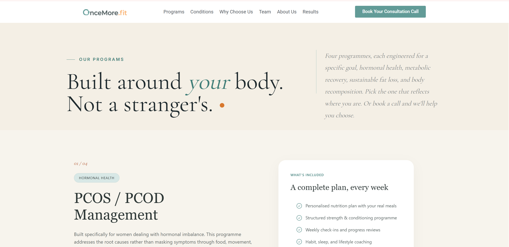
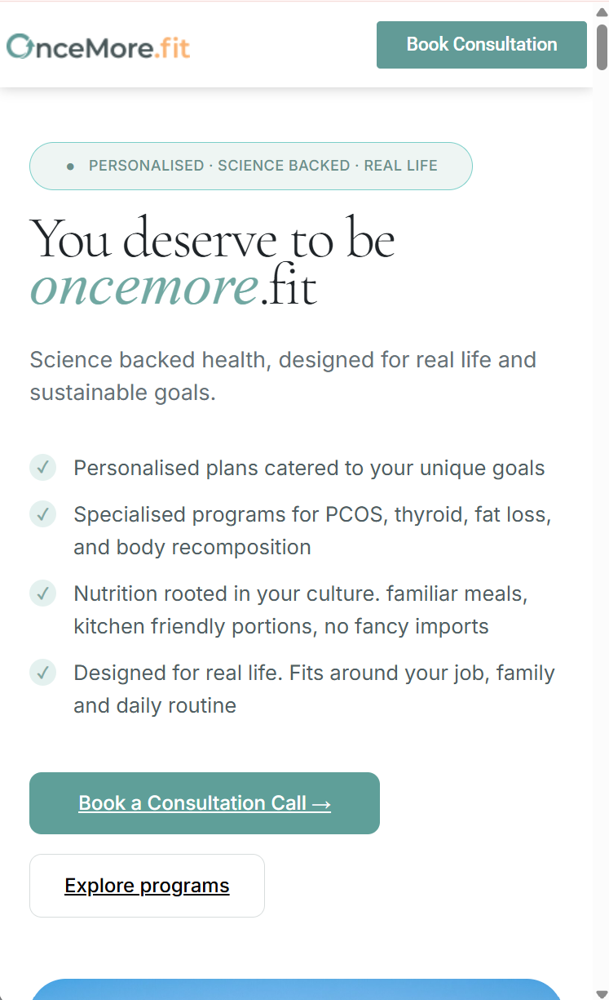
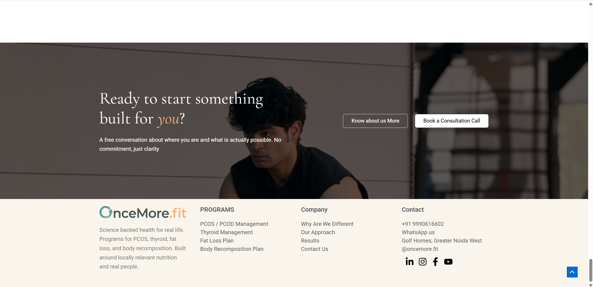

  
  <strong>Building a science-backed wellness brand with a high-converting digital ecosystem—from branding to lead generation.</strong>

## 🌐 Client

**Client:** OnceMore.fit

**Industry:** Health & Fitness Coaching

**Duration:** 4 Months

**Website:** https://oncemore.fit

---

## 📌 Services Delivered

- 🎨 Brand Identity & Logo Design
- 🌐 WordPress Website Design & Development
- 📱 Social Media Management
- 🎥 Creative Production
- 📈 Meta Ads Lead Generation
- ✍️ Content Strategy
- 💡 Landing Page Optimization

---

## 🎯 Project Overview

OnceMore.fit partnered with **The Digital Hike** to establish a trusted digital presence for its science-backed health and fitness coaching brand. Our objective was to create a premium brand identity, build a high-converting WordPress website, develop engaging social media content, and generate qualified consultation leads through Meta advertising.

---

## 🚀 What We Built

- Premium Brand Identity & Logo
- Conversion-focused WordPress Website
- Program Pages for PCOS, PCOD, Thyroid, Fat Loss & Body Recomposition
- Consultation Booking Journey
- Social Media Management
- Creative Design & Video Editing
- Meta Ads Lead Generation Campaigns
- Scalable Digital Growth System

---

## 💡 Key Features

- 🏋️ Science-backed wellness programs
- 🥗 Nutrition-focused coaching
- 💻 Responsive WordPress website
- 📅 Consultation booking system
- 📱 Multi-platform social media management
- 📈 Meta Ads for qualified lead generation

---

## 📄 Case Study

📥 **[Download the Complete Case Study](oncemorefit-case-study.pdf)**

---

# 📸 Website Showcase

## 🏠 Homepage

---

## 💪 Programs Page

---

## 🌿 Services

---

## 👩‍⚕️ About

---

## 📱 Mobile Experience

---

## 📞 Contact Page

---

## 🌍 Live Website

🔗 https://oncemore.fit

---

## ✨ Project Highlights

- Built a calm, trustworthy wellness brand identity
- Designed a conversion-focused WordPress website
- Structured dedicated program pages for health conditions
- Managed social media across Instagram, Facebook, YouTube & LinkedIn
- Produced creatives including statics, carousels & videos
- Executed Meta Ads campaigns to generate qualified consultation leads
- Created a scalable digital marketing ecosystem supporting long-term growth

---

## ← Back to Portfolio

[⬅ Return to Portfolio](../../README.md)
[⬅ Return to Portfolio](../../README.md)
